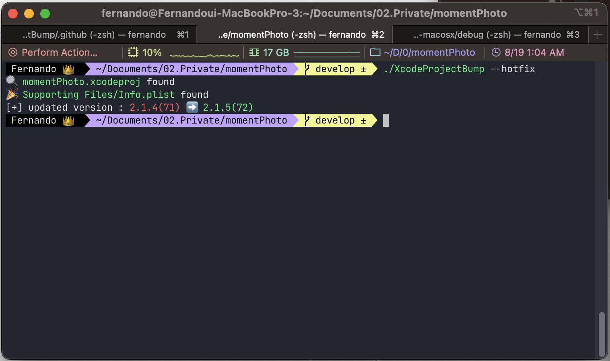

# 🚀 XcodeProjectBump

A Swift command-line tool designed to automate version updates for `Info.plist` in Xcode projects.

## 🌟 Introduction

Updating the version of an application can be repetitive. XcodeProjectBump is here to make this task a breeze. With a simple command, you can update major, minor, hotfix, or build versions. It intelligently searches for your `Info.plist` file within your project, and applies the required changes. Say goodbye to manual version bumping!

## ✨ Features

- 🔍 Auto-detection of `Info.plist` file in Xcode project.
- 📈 Easily bump major, minor, hotfix, or build versions.
- 🍏 Built with Swift and leverages the power of `XcodeProj` for project manipulations.

## 💽 Installation

(Here, you can provide details on how to clone the repository, build the tool, and install it.)

## 📖 Usage

To use XcodeProjectBump, navigate to your Xcode project's root directory in the terminal and type:



```bash
$ XcodeProjectBump [flags]
```

### Flags:

- --major: To bump the major version (e.g., 1.0.0 to 2.0.0).
- --minor: To bump the minor version (e.g., 1.0.0 to 1.1.0).
- --hotfix: To bump the hotfix version (e.g., 1.0.0 to 1.0.1).
- --build: To bump the build number (e.g., 10 to 11).

 Note: If multiple flags are provided, the tool will prioritize major > minor > hotfix.

Example:
To bump the minor version:

```bash 
$ XcodeProjectBump --minor
```

The tool will output the previous and updated versions for confirmation.

## 🤝 Contributing

We welcome contributions! Please raise an issue or submit a pull request if you would like to contribute.

## 📜 License

XcodeProjectBump is available under the MIT license. See the LICENSE file for more info.

